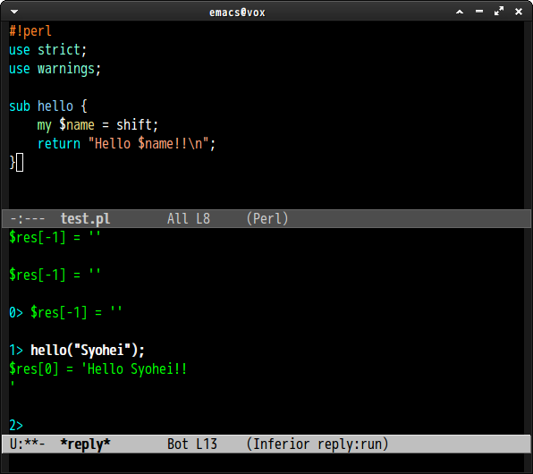

# reply.el
*reply.el* is Emacs front end of [Reply](https://github.com/doy/reply).


## screenshot




## Basic Usage

### `run-reply`

Run reply REPL.

### `reply-send-region`

Send region to reply REPL process.


## Sample Configuration

```elisp
(require 'reply)

(defun reply-other-window ()
  "Run reply on other window"
  (interactive)
  (switch-to-buffer-other-window
   (get-buffer-create "*reply*"))
  (run-reply "reply"))

(require 'cperl-mode)
(define-key cperl-mode-map (kbd "C-c C-r") 'reply-send-region)
(define-key cperl-mode-map (kbd "C-c C-z") 'reply-other-window)
```
